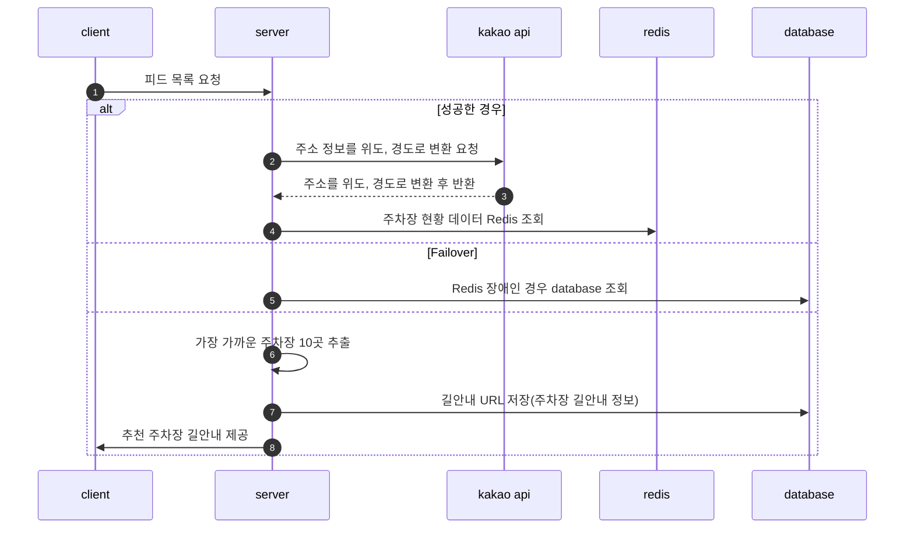
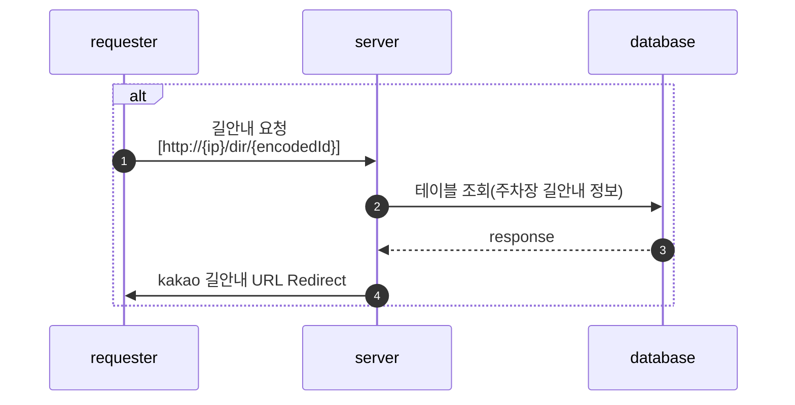

# Parking Lot Finder

[공공 데이터(전국 공영 주차장 정보)](https://www.data.go.kr/data/15050093/fileData.do)와 [카카오 주소 검색 API](https://developers.kakao.com/docs/latest/ko/local/dev-guide)를 활용하여 요청한 위치 기준 20Km내에서 가장 가까운 주차장 10곳을 검색해주며, 검색된 주차장의 길 안내는 [카카오 지도 및 로드뷰 바로가기 URL](https://apis.map.kakao.com/web/guide/#routeurl)로 제공 된다.   

## 요구사항 분석 

- 주차장 검색 서비스 요구사항
  - 해당 서비스로 주소 정보를 입력하여 요청하면 위치 기준에서 가까운 주차장 10곳을 추출한다.
  - 주소 입력은 [Kakao 우편번호 서비스](https://postcode.map.daum.net/guide)를 사용한다. 
  - 주소는 정확한 상세 주소(동, 호수)를 제외한 주소 정보를 이용하여 추천 한다.   
  - 입력 받은 주소를 위도, 경도로 변환 하여 기존 주차장 데이터와 비교 및 가까운 주차장을 찾는다.   
    - 지구는 평면이 아니기 때문에, 구면에서 두 점 사이의 최단 거리 구하는 공식이 필요하다.
    - 두 위 경도 좌표 사이의 거리를 [haversine formula](https://en.wikipedia.org/wiki/Haversine_formula)로 계산한다.
    - 지구가 완전한 구형이 아니 므로 아주 조금의 오차가 있다.   
  - 입력한 주소 정보에서 정해진 반경(20km) 내에 있는 주차장만 추천한다.   
  - 추출한 주차장 데이터는 길안내 URL 및 로드뷰 URL로 제공한다.   

  - 길안내 URL은 고객에게 제공 되기 때문에 가독성을 위해 shorten url로 제공한다.
  - shorten url에 사용 되는 key값은 인코딩하여 제공한다.
    - ex) http://localhost:8080/dir/nqxtX
    - base62를 통한 인코딩    
  - shorten url의 유효 기간은 30일로 제한한다.   
  
## Parking Lot Finder Process   

       

## Direction Shorten Url Process

## Feature List   

- Spring Data JPA를 이용한 CRUD 메서드 구현하기      
- Spock를 이용한 테스트 코드 작성하기     
- Testcontainers를 이용하여 독립 테스트 환경 구축하기
- 카카오 주소검색 API 연동하여 주소를 위도, 경도로 변환하기   
- 추천 결과를 카카오 지도 URL로 연동하여 제공하기   
- 공공 데이터를 활용하여 개발하기 (공영주차장 현황 데이터)
- Handlebars를 이용한 간단한 View 만들기   
- Docker를 사용하여 다중 컨테이너 애플리케이션 만들기   
- 애플리케이션을 클라우드 서비스에 배포하기   
- Spring retry를 이용한 재처리 구현하기 (카카오 API의 네트워크 오류 등에 대한 재처리)   
- base62를 이용한 shorten url 개발하기 (길안내 URL)   
- redis를 이용하여 성능 최적화하기   

## Tech Stack   

- JDK 11
- Spring Boot 2.6.7
- Spring Data JPA
- Gradle
- Lombok
- Docker
- Redis
- MariaDB
- Handlebars
- Spock   
- Testcontainers   

## Result 

